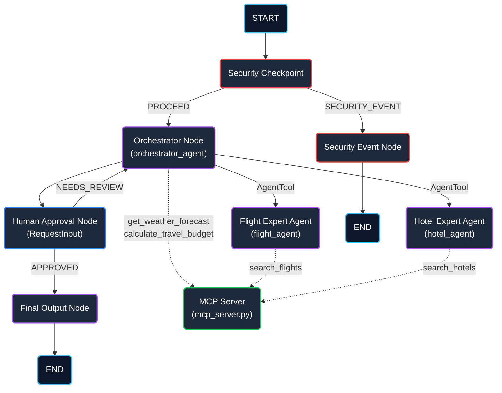

# ✈️ Travel Planner & Local Itinerary Guide — Submission Write-Up

## Problem Statement
Planning a vacation requires coordinating multiple moving parts, including searching for flights, finding hotel accommodations, checking weather conditions, and reconciling all elements against a strict travel budget. Doing this manually is time-consuming and error-prone. While standard LLMs can assist with planning, they lack access to real-time resources and present major security risks, such as exposing sensitive user PII (passport numbers, phone numbers, credit cards) to external model hosts or executing malicious prompt injections embedded in external queries. 

`travel-planner` addresses these challenges by orchestrating a secure multi-agent workflow that automates retrieval from real-time endpoints (via Model Context Protocol) and validates inputs against security and domain rules before running LLM operations.

---

## Solution Architecture

---

## Concepts Used

This application leverages several key features of the Google Agent Development Kit (ADK) 2.0:

1. **ADK Workflow Graph API**: Orchestrates execution state and paths deterministically.
   - *Reference*: [`app/agent.py`](app/agent.py) (lines 173-195)
2. **LlmAgent**: Encapsulates specialized roles and context models.
   - *Reference*: [`app/agent.py`](app/agent.py) (lines 22-86)
3. **AgentTool**: Facilitates clean agent-to-agent delegation, wrapping sub-agents (`flight_agent` and `hotel_agent`) as tools invoked directly by the supervisor orchestrator.
   - *Reference*: [`app/agent.py`](app/agent.py) (lines 49-52)
4. **MCP Server**: Provides sandboxed access to local APIs and functions using `FastMCP`.
   - *Reference*: [`app/mcp_server.py`](app/mcp_server.py)
5. **Security Checkpoint**: Implements validation gating as a first-class workflow node.
   - *Reference*: [`app/agent.py`](app/agent.py) (lines 89-140)
6. **Agents CLI**: Utilizes `agents-cli` for scaffolding, environment configurations, and playground testing.

---

## Security Design

The application enforces security at the boundary via a `security_checkpoint` workflow node:

- **PII Scrubbing**: Regex patterns scrub passport numbers, credit cards, and phone numbers before they are sent to the orchestrator agent, ensuring sensitive info is never sent to the LLM.
- **Prompt Injection Detection**: Key phrases such as `ignore previous instructions` trigger an immediate routing bypass to the `security_event_node`, halting execution.
- **Domain-Specific Rules**: Restricts execution to valid budget queries (e.g. rejects budgets `<= 0` or `"free"` travel requests).
- **Structured Audit Logging**: Outputs audit trails in standardized JSON format for threat monitoring and SIEM integration.

---

## MCP Server Design

The Model Context Protocol (MCP) server exposes 4 main travel-specific tools:

1. `search_flights`: Fetches live mock flights based on travel dates.
2. `search_hotels`: Searches for lodging accommodations based on ratings and daily pricing.
3. `get_weather_forecast`: Provides destination weather forecasts to help plan packing.
4. `calculate_travel_budget`: Automatically calculates a breakdown of all flight, hotel, and allowance costs.

---

## HITL Flow (Human-in-the-Loop)

The workflow includes a `human_approval_node` which uses `RequestInput` to pause execution after the orchestrator prepares the initial itinerary. This ensures the user review stage is enforced:
- If approved (`yes`), the workflow completes and confirms the reservation details.
- If changes are requested, the feedback is saved to `ctx.state`, appended to the user query, and the graph loops back to the `orchestrator_node` to rebuild the plan.

---

## Demo Walkthrough

The project includes 3 distinct test scenarios detailed in the [`README.md`](README.md):
1. **Success Path**: End-to-end flight/hotel gathering, budget checking, and human confirmation.
2. **Budget Validation failure**: Demonstrates immediate block of an invalid negative budget.
3. **Prompt Injection blocker**: Demonstrates immediate routing to `SECURITY_EVENT` when malicious keywords are input.

---

## Impact / Value Statement
`travel-planner` provides a robust template for enterprise travel planning. By utilizing a multi-agent hierarchy and sandbox local tooling, it significantly reduces the time required to build travel plans while safeguarding personal information, enforcing security policies, and keeping a human decision-maker in control at all stages.
